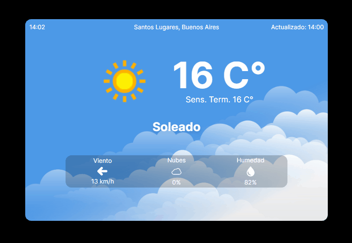

# Weather Widget

This is a weather widget built in Next.js, which allows users to get the current weather information for their browser's location.



[Working Demo](https://weather-app-neon-tau-46.vercel.app/)

## Features

- Display current weather information for a specified location.
- Retrieve weather data using the [WeatherAPI](https://www.weatherapi.com/), since APIkey is required, the API call is hidden from the client using an intermediary API located on server.
- Since location in WeatherAPI lacks of precision, browser's geographical data is used to make another API call to [Geocode Free API](https://geocode.maps.co/)
- 41 languages available, selection based on browser's language, defaults to english if browsers language is not found on locale.json.
- Automatically detects user's location if permission is granted.

## Installation

1. Clone the repository:

   ```shell
   git clone https://github.com/your-username/weather-widget.git

2. Create .env.local with API URL and API key:
   ```shell
   URL_WEATHER=http://api.weatherapi.com/v1
   API_KEY_WEATHER=YOUR_API_KEY
